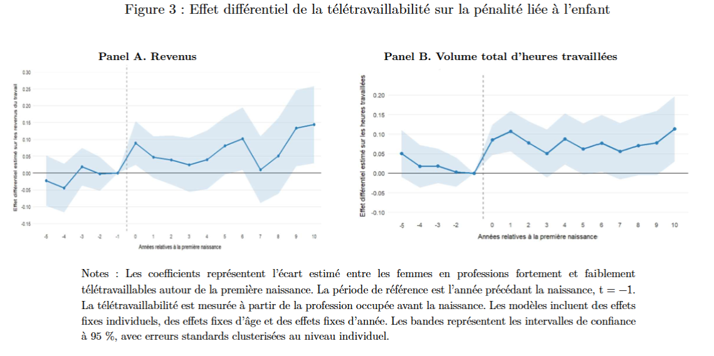
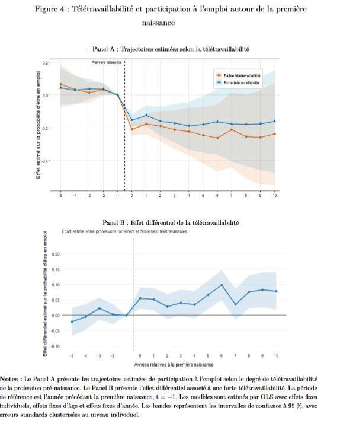

# Can telework mitigate the motherhood penalty ? Evidence from the UK

This repository presents the main R code used for my Master 2 research project in Public Policy at Université Paris 1 Panthéon-Sorbonne.

## Research question

This project studies whether teleworkability can mitigate the motherhood penalty in the United Kingdom.

Using longitudinal data from the UK Household Longitudinal Study (UKHLS), I analyse how women's employment trajectories evolve around the birth of their first child and whether these effects differ according to the teleworkability of their occupation before childbirth.

## Data

- UK Household Longitudinal Study (UKHLS)
- Waves 1 to 15
- Period: 2009–2024
- Longitudinal individual data
- Main outcomes: labour income, hours worked, employment participation and hourly wage

The raw UKHLS data are not included in this repository due to access and redistribution restrictions.

## Methodology

The analysis includes:

- import and harmonisation of 15 UKHLS waves;
- construction and cleaning of a longitudinal individual panel;
- identification of the first childbirth event and construction of relative event time;
- matching occupational ISCO-88 codes with a teleworkability score;
- event-study estimations;
- individual, year and age fixed effects;
- clustered standard errors;
- Poisson Pseudo-Maximum Likelihood models for outcomes including zero values;
- heterogeneity analysis according to pre-birth occupational teleworkability;
- a complementary analysis exploiting the Covid-19 pandemic as a large-scale activation shock of remote work.

## Main findings

The results indicate that women in highly teleworkable occupations experience a smaller motherhood penalty after the birth of their first child.

In the short run, high teleworkability is associated with an attenuation of approximately 6.5 percentage points in the labour-income penalty and 7 percentage points in the reduction in total hours worked. The difference also appears to persist over a longer horizon.

### Teleworkability and the motherhood penalty

The figure below presents the estimated differential effect between women in highly and weakly teleworkable occupations around the birth of their first child.

Pre-birth coefficients are close to zero, while positive differences emerge after childbirth. Ten years after the first birth, the estimated income penalty is approximately 9.7 percentage points lower among women in highly teleworkable occupations.

## Employment participation

The results suggest that the main mechanism operates through the extensive margin: women in highly teleworkable occupations are more likely to remain employed after childbirth.

At the time of the first birth, employment participation is approximately 5.6 percentage points higher among women in highly teleworkable occupations relative to women in occupations with lower teleworkability. This difference remains positive over the post-birth period.

By contrast, the results conditional on remaining employed provide less robust evidence of an effect on hours worked or hourly wages, suggesting that teleworkability primarily helps women remain attached to employment rather than preserving working hours among those already employed.

## Covid-19 robustness analysis

As a complementary robustness analysis, I exploit the Covid-19 pandemic as a large-scale activation shock of remote work.

The intuition is that, before the pandemic, occupational teleworkability represented mainly a theoretical capacity to work remotely. From 2020 onward, remote work became effectively available on a much larger scale.

For total hours worked, no clear differential is observed before the widespread activation of remote work. After 2020, the differential becomes positive and significant at childbirth: women in highly teleworkable occupations work approximately 17.9% more hours relative to women in weakly teleworkable occupations.

This result provides additional support for the interpretation that telework can mitigate the motherhood penalty and that the main results are not solely driven by pre-existing differences between occupations. Results for labour income are less conclusive because of non-parallel pre-trends.

## Repository structure

- `R/01_prepare_data.R`: import, harmonisation and construction of the longitudinal panel
- `R/02_build_variables.R`: construction of childbirth, employment and teleworkability variables
- `R/03_event_study.R`: main econometric estimations and Covid-19 robustness analysis
- `R/04_figures.R`: production of the main event-study figures
- `outputs/`: selected graphical outputs

## Tools

R

## Author

Boris Vincent  
Master 2 Politiques Publiques  
Université Paris 1 Panthéon-Sorbonne
